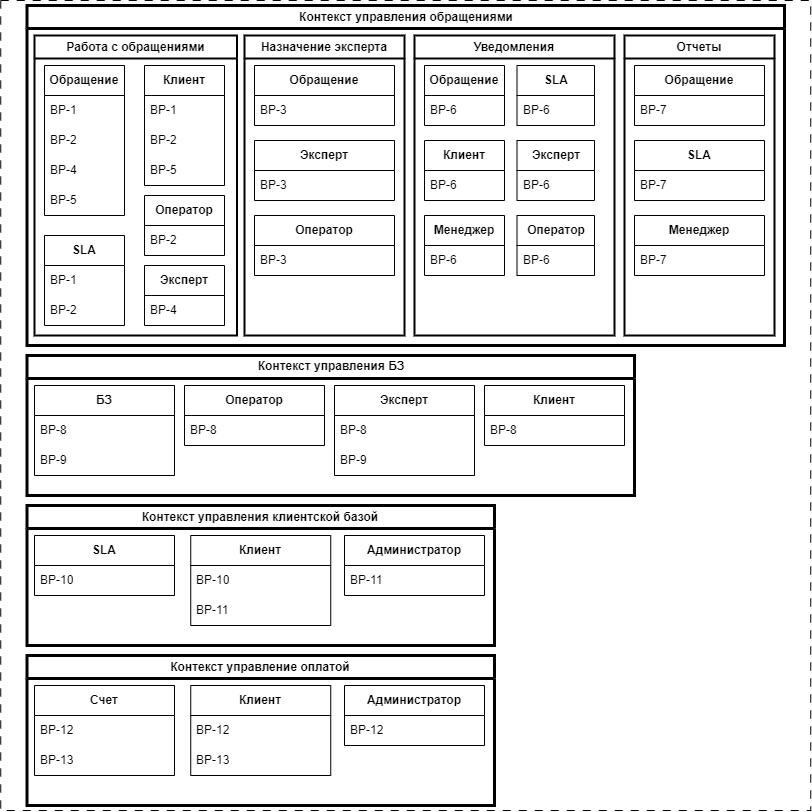

# Основные сценарии

* **UC-1**: **Регистрация клиента**:
     - клиенты регистрируют учётную запись, привязывают кредитную карту и выбирают план поддержки;
     - администратор занимается вопросами поддержи учётных записями клиентов.

* **UC-2**: **Работа с обращениями**:
     - клиенты создают обращение через веб-интерфейс и по телефону;
     - специалисты callcenetr регистрируют обращения клиентов поступающих по телефону;
     - назначение эксперта по обращению происходит автоматически;
     - специалисты callcenetr выполняют первичную обработку обращения в случае, если не удалось назначить эксперта по обращению автоматически;
     - эксперты выполняют назначенные на них обращения;
     - клиенты оценивают качество выполненных работ по обращению;

* **UC-3**: **Работа с базой знаний**:
     - клиенты, специалисты callcenetr и эксперты осуществляют поиск по базе знаний;
     - эксперты обновляют базу знаний;

* **UC-4**: **Отчетность**:
     - менеджеры отслеживают уровень предоставленяи услуг клиентам по обращениям;
     - менеджеры формируют оперативные и аналитические отчеты по обращениям;

* **UC-5**: **Оплата и биллинг**:
     - счета клиентам выставляются автоматически ежемесячно;
     - клиенты просматривают историю своих счетов и списаний;
     - администратор управляет обработкой счетов для клиентов;

* **UC-6**: **Уведомления**:
     - клиенты получают email уведомления о жизненном цикле обращения;
     - эксперты получают email уведомления о назначении обращения;
     - специалисты callcenetr получают email уведомления о не назанченных автоматически обращениях на экспертов;
     - менеджеры получают email уведомления о нарушении уровня обслуживания по ообращению;

# Субдомены и процессы

Исходя из описания основных сценариев использования и функциональных требований  можем выделить следующие субдомены проблемной области и процессы:

* Управление обращениями
    - BP-1: Процесс регистрации обращения через web-интерфейс клиентом
    - BP-2: Процесс регистрации обращения клиента по телефону
    - BP-3: Процесс назначения эксперта по обращению
    - BP-4: Процесс выполнения работ по обращению экспертом
    - BP-5: Процесс оценки качества выполнненых работ по обращению клиентом
    - BP-6: Процесс формирования и отправки уведомлений по обращению
    - BP-7: Процесс формирования отчётности по обращениям менеджером
* Управление базой знаний
    - BP-8: Процесс поиска по БЗ
    - BP-9: Процесс наполнения и обновления информации в БЗ экспертом
* Управление клиентской базой
    - BP-10: Процесс регистрации учетных записей клиентов
    - BP-11: Процесс поддержки учётных записей клиентов
* Управление оплатой
    - BP-12: Процесс формирования счетов на оплату
    - BP-13: Процесс просмотра клиентом истории счетов и списаний

# Моделирование предметной области

## Идентифкация контекстов и их размеров

### Вариант 1

Исходя из описания основных сценариев использования и процессов можем выделить следующие ограниченные контексты:
- Контекст управления обращениями
- Контекст управления БЗ
- Контекст клиентской базой
- Контекст управления оплатой

В данной модели мы получили 4 ограниченных контекста предметной области, слабо связанные друг с другом в части бизнес-логики.

### Вариант 2
Контекст управления обращениями получился большим и его имеет смысл декопмозировать на несколько отдельных ограниченных контекстов меньшего размера.
Исходя из описания основных сценариев использования и процессов в контексте управления обращениями можем выделить следующие ограниченные контексты:
- Работа с обращениями
- Назначение эксперта
- Уведомления
- Отчетность

В данной модели мы видим, что контексты "Работа с обращениями", "Назначение эксперта", "Уведомления", "Отчетность" практически не связаны друг с другом в части бизнес-логики. Это позволяет нам выделить их в отдельные строительные блоки(модули) системы.

## Оценка модифицируемости

### Сценарии модифицируемости

* MS-1: Модификация или добавление функционала на карточке обращения:
     * Добавление полей объекта Обращение
     * Добавление возможности изменения клиентом параметров обращения в созданном обращении
     * Расширение статусной модели обращения

* MS-2: Модификация процесса назначения эксперта по обращению:
     * Изменение правил выбора эскперта по обращению
     * Добавление характеристик эксперта

* MS-3: Модификация процесса формирования и отправки уведомлений по обращению
     * Изменение правил отправки уведомлений
     * Изменение шаблонов уведомлений

* MS-4: Модификация функционала в контексте управления БЗ
     * Изменение полей объекта БЗ
     * Изменение механизма полнотекстового поиска по БЗ

* MS-5: Модификация функционала в контексте управления клиентской базой
     * Изменение процесса регистрации учетных записей клиентов

### Анализ и оценка модифицируемости

| Сценарий |Оценка по v1| Оценка по v2| Комментарий |
|----|----|----|----|
|MS-1|++|+-|Модификации по данному сценарию могут повлиять на весь контекст управления обращениями, но по Варианту-1 потребуется меньше согласованных изменений|
|MS-2|--|++|Модификации по данному сценарию выгоднее выполнять при использовании Варианта-2, так как эти зменения возможно выполнять не затрагивая другие ограниченные контексты|
|MS-3|+-|+-|----|
|MS-4|++|++|----|
|MS-5|++|++|----|

Исходя из представленных вариантов декомпозиции можно сделать следующие выводы:
