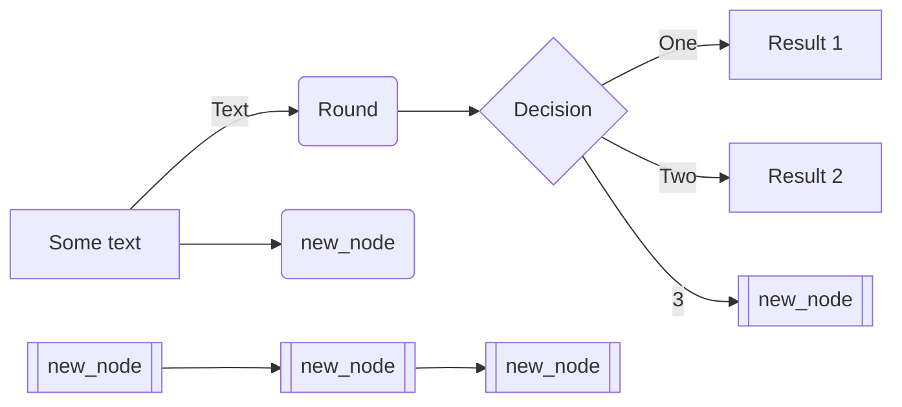

# The Sysops Squad Architectural Kata

## Содержание

- [Введение и цели](#1-введение-и-цели)
  - [Кейс](#Кейс)  
  - [Бизнес-драйверы](#бизнес-драйверы)
  - [Бизнес-цель](#бизнес-цель)
  - [Стэйкхолдеры](#стэйкхолдеры)
- [Требования](#2-требования)  
  - [Атрибуты качества](#атрибуты-качества)
  - [Функциональные требования](#функциональные-требования)
  - [Ограничения](#ограничения)
- [Область действия и контекст системы](#3-контекст)
  - [Бизнес контекст](#бизнес-контекст)
  - [Технический контекст](#технический-контекст)
- [Архитектурные решения](#4-архитектурные-решения)

## 1. Введение и цели

### Кейс

Penultimate Electronics — крупный электронный гигант, имеющий множество розничных
магазинов по всей стране. Когда клиенты покупают компьютеры, телевизоры, стереосистемы
и другое электронное оборудование, они могут приобрести план поддержки. Затем
специалисты техподдержки, работающие с клиентами («Отряд сисопов»), приходят к клиенту
(или в рабочий офис), чтобы устранить проблемы с электронным устройством.
Текущая система заявок на устранение неполадок представляет собой большое монолитное
приложение, разработанное много лет назад. Клиенты жалуются, что консультанты иногда не
появляются из-за потерянных заявок, и часто не тот консультант приходит, чтобы исправить
то, о чем они ничего не знают. Клиенты и сотрудники колл-центра жалуются на то, что система
не всегда доступна для ввода заявок через Интернет или по телефону. Изменения в этом
огромном монолите сложны и рискованны: всякий раз, когда вносятся изменения, они
занимают слишком много времени, и обычно что-то еще ломается. Из-за проблем с
надежностью монолитная система часто «зависает» или дает сбой — они думают, что это в
основном связано с пиками по утилизации и количеством клиентов, использующих систему.
Если что-то не будет сделано в ближайшее время, Penultimate Electronics будет вынуждена
отказаться от этого очень прибыльного направления бизнеса и уволить всех специалистов.

### Бизнес-драйверы

* Текущая система зависает.
* Текущая система не всегда доступна для клиентов и специалистов поддержки.
* Текущая система иногда теряет заявки или назначение происходит не на того специалиста.
* Доработки текущей системы крайне трудозатратны и несут риски.
* Penultimate Electronics будет вынуждена отказаться от этого направления бизнеса и уволить сотрудников, если в ближайшее время система ServiceDesk не будет изменена.

### Бизнес-цель

Внедрить , в короткие сроки, новую систему ServiceDesk. Система должна обеспечивать стабильую и надежную работу службы поддержки, которая позволит компании остаться в этом сегменте бизнесе и обеспечить будущий рост.

### Стэйкхолдеры
| # |Сценарии|
|----|----
| Клиенты| Клиент регистрируется на портале поддержки, выбирает план поддержки и вносит информацию о кредитных картах. Клиенты могут создавать в системе обращения, вносить дополнительную информацию, а также оценивать качество выполненных работ. Клиенты могут выполнять поиск по базе знаний.|
| Администраторы| Администратор работает с информацией об учётных записях внутренних пользователей системы и зарегистрированных в системе клиентов. Администратор так же занимается вопросамии связанными с биллинговой системой.|
| Call Center | Сотрудники Call-Center  занимаются первичной обработкой входящего потока заявок регистрируемых клиентами вручную и по телефону. Также они используют базу знаний для быстрого поиска решения по проблемам клиентов. Если сотрудники Call-Center  не могут решить проблему на первой линни, то назначают заявки Экспертам. |
| Эксперты | Эксперты выполняют назначенные на них заявки. Они приходят к клиенту и устраняют проблемы с техникой, затем отмечают в системе выполненные работы и закрывают заявку. Эксперты пользуются базой знаний для поиска решений проблем клиентов, а так же поддерживают её в актуальном состоянии.|
| Менеджеры| Менеджер отслеживает уровень обслуживания в соответсвии с планом поддержки клиентов.  Формирует оперативные и аналитические отчеты.|
| Разработчики| Выполняют техническое обслуживание и доработки системы.|

---
## 2. Требования

### Атрибуты качества

| # |Атрибуты качества| Описание|
|----|----|----|
| 1 |Производительность|Система должна иметь высокую производительность. Время отклика < 2 с при загрузке страницы.
| 2 |Доступность|Система должна соответствовать доступности равной 99.9%. 
| 3 |Надежность|Критичные для работы системы компоненты  должны иметь резервирование.
| 4 |Масштабируемость|Система должна иметь возможность горизонтального масштабирования.
| 5 |Обслуживаемость|Система должна обеспечивать возможность быстрой доработки функционала и доставки изменений, без необходимости приостановки клиентского сервиса.
| 6 |Безопасность| Методы хранения и обработки перс.данных клиентов должны удовлетворять требованиям законодательства.

### Функциональные требования

| # | Описание |
| ------- | ------- |
| 1 | Система должна обеспечивать автоматизацию следующих процессов ITIL: <ul><li>Управление инцидентами</li><li>Управление запросами на обслуживание</li><li>Управление знаниями</li><li>Управление каталогом услуг</li><li>Управление уровнем услуг</li><li>Управление конфигурациями</li></ul>
| 2 | Система должна иметь понятный и дружественный интерфейс для клиентов и специалистов поддержки.
| 3 | Система должна иметь высокоточный функционал автоматического назначения специалистов по заявкам.
| 4 | Система должна иметь гибкий функционал настройки правил отправки нотификаций о заявках для специалистов поддержки и клиентов.
| 5 | Система должна обладать возможностью настройки различных ролей пользователей и схем разграничения прав доступа.
| 6 | Система должна обладать функционалом web-портала для клиентов. Портал должен иметь следующие возможности: <ul><li>Регистрация и авторизация клиентов, создание профиля</li><li>Работа с обращениями: поиск, создание, изменение, возможность выставить оценку выполненых работ</li><li>Выбор плана поддержки</li><li>Поиск информации по базе знаний</li><li>Безопасный интерфейс для ввода данных кредитных карт</li><li>Возможность просмотра истории своих платежей и списаний</li></ul>
| 7 | Система должна обеспечивать возможность безопасного хранения персональных данных и кредитных карт клиентов.
| 8 | Система должна обеспечивать возможность работы на мобильном устройстве для специалистов поддержки.
| 9 | Система должна иметь функционал полнотекстового поиска по заявкам и базе знаний.
| 10 | Система должна иметь REST API для возможности интеграции с внешними приложениями. 

### Ограничения

| # | Описание |
| ------- | ------- |
| 1 | Внедрить новую систему требуется в короткие сроки, поскольку это может повлиять на бизнес.
| 2 | Стоимость внедрения и владения новой системы должна быть приемлимой.
| 3 | Показатель TTM для новых фич и доработок функционала в новой системе имеет большое значение.

---

## 3. Область действия и контекст системы

### Системный контекст

### Диаграмма контейнеров

---

## 4. Архитектурные решения

| ADR | Описание |
| ------- | ------- |
| [ADR-1](ADRs/ADR-1.md) | ADR-1: Использовать вендорское решение для системы Service Desk.
| [ADR-2](ADRs/ADR-2.md) | ADR-2: Использовать облачный провайдер для деплоя компонентов системы.
| [ADR-3](ADRs/ADR-3.md) | ADR-3: Использовать двухэтапную стратегию для классификации заявок и назначения Эксперта.
| [ADR-4](ADRs/ADR-4.md) | ADR-4: Использовать read-only реплику БД системы для отчётности.
| [ADR-5](ADRs/ADR-5.md) | ADR-5: Использовать отдельный портал для клиентов.
| [ADR-6](ADRs/ADR-6.md) | ADR-6: Использовать read-only реплику БД системы для Базы Знаний доступной на клиентском портале.

### Some diagram

