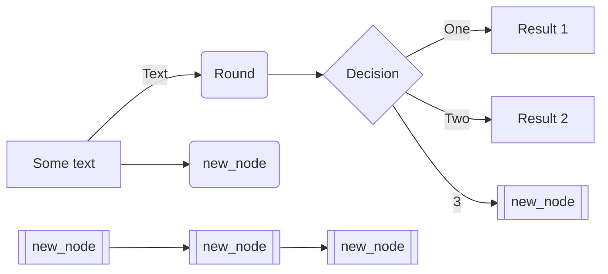
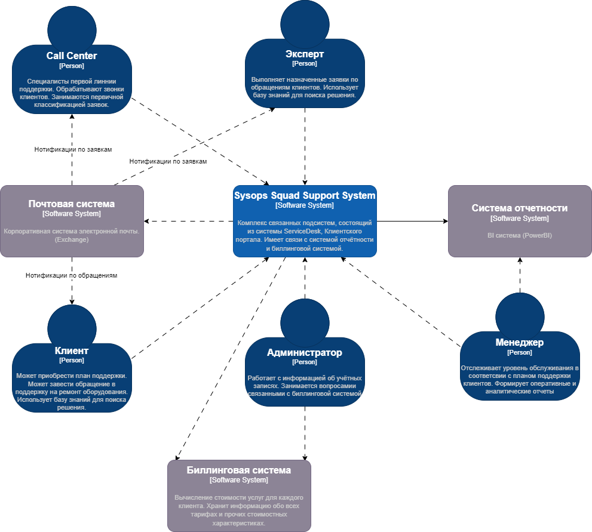

| Column1 | Column2 | Column3 |   |
| ------- | ------- | ------- | - |
| Row1    | 2       | 3       |   |
| Row2    |         |         |   |
| Row3    |         |         |   |
| Row4    |         |         |   |

---

### Some diagram

---

### Some C4

> [!NOTE]
> Some note

1. asdasd
2. asdas
3. sadasd

---

[link to ADRs](ADRs\09_architecture_decisions.md)

