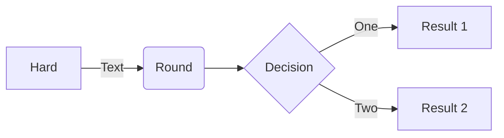

|Column1  |Column2  |Column3  |
|---------|---------|---------|
|Row1     |         |         |
|Row2     |         |         |
|Row3     |         |         |
|Row4     |         |         |

:::image type="content" source="diagrams/C4.drawio.png" alt-text="c4":::