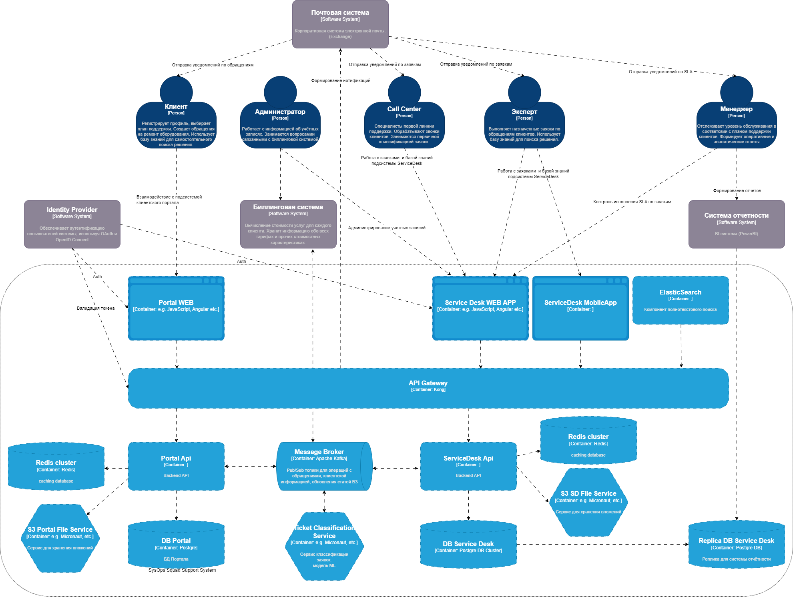

# The Sysops Squad Architectural Kata

## Содержание

- [Введение и цели](#1-введение-и-цели)
  - [Кейс](#Кейс)  
  - [Бизнес-драйверы](#бизнес-драйверы)
  - [Бизнес-цель](#бизнес-цель)
  - [Стэйкхолдеры](#стэйкхолдеры) Ограничения
  - [Ограничения](#ограничения)
- [Требования](#2-требования)  
  - [Функциональные требования](#функциональные-требования)
  - [Атрибуты качества](#атрибуты-качества)
- [Функциональная декомпозиция](#3-функциональная-декомпозиция)
  - [Основные сценарии использования](#основные-сценарии-использования)
  - [Субдомены и процессы](#субдомены-и-процессы)
  - [Моделирование предметной области](#моделирование-предметной-области)
- [Область действия и контекст системы](#4-область-действия-и-контекст-системы)
  - [Системный контекст](#системный-контекст)
  - [Диаграмма контейнеров](#диаграмма-контейнеров)
  - [Диаграмма развертывания](#диаграмма-развертывания)
- [Диаграммы последовательности для пользовательских сценариев](#5-диаграммы-последовательности-для-пользовательских-сценариев)
- [Архитектурные решения](#6-архитектурные-решения)

## 1. Введение и цели

### Кейс

Penultimate Electronics — крупный электронный гигант, имеющий множество розничных
магазинов по всей стране. Когда клиенты покупают компьютеры, телевизоры, стереосистемы
и другое электронное оборудование, они могут приобрести план поддержки. Затем
специалисты техподдержки, работающие с клиентами («Отряд сисопов»), приходят к клиенту
(или в рабочий офис), чтобы устранить проблемы с электронным устройством.
Текущая система заявок на устранение неполадок представляет собой большое монолитное
приложение, разработанное много лет назад. Клиенты жалуются, что консультанты иногда не
появляются из-за потерянных заявок, и часто не тот консультант приходит, чтобы исправить
то, о чем они ничего не знают. Клиенты и сотрудники колл-центра жалуются на то, что система
не всегда доступна для ввода заявок через Интернет или по телефону. Изменения в этом
огромном монолите сложны и рискованны: всякий раз, когда вносятся изменения, они
занимают слишком много времени, и обычно что-то еще ломается. Из-за проблем с
надежностью монолитная система часто «зависает» или дает сбой — они думают, что это в
основном связано с пиками по утилизации и количеством клиентов, использующих систему.
Если что-то не будет сделано в ближайшее время, Penultimate Electronics будет вынуждена
отказаться от этого очень прибыльного направления бизнеса и уволить всех специалистов.

### Бизнес-драйверы

* Текущая система зависает.
* Текущая система не всегда доступна для клиентов и специалистов поддержки.
* Текущая система иногда теряет заявки или назначение происходит не на того специалиста.
* Доработки текущей системы крайне трудозатратны и несут риски.
* Penultimate Electronics будет вынуждена отказаться от этого направления бизнеса и уволить сотрудников, если в ближайшее время система ServiceDesk не будет изменена.

### Бизнес-цель

Внедрить , в короткие сроки, новую систему ServiceDesk. Система должна обеспечивать стабильую и надежную работу службы поддержки, которая позволит компании остаться в этом сегменте бизнесе и обеспечить будущий рост.

### Стэйкхолдеры

| # |Сценарии|
|----|----
| Клиенты| Клиент регистрируется на портале поддержки, выбирает план поддержки и вносит информацию о кредитных картах. Клиенты могут создавать в системе обращения, вносить дополнительную информацию, а также оценивать качество выполненных работ. Клиенты могут выполнять поиск по базе знаний.|
| Администраторы| Администратор работает с информацией об учётных записях внутренних пользователей системы и зарегистрированных в системе клиентов. Администратор так же занимается вопросамии связанными с биллинговой системой.|
| Call Center | Сотрудники Call-Center  занимаются первичной обработкой входящего потока заявок регистрируемых клиентами вручную и по телефону. Также они используют базу знаний для быстрого поиска решения по проблемам клиентов. Если сотрудники Call-Center  не могут решить проблему на первой линни, то назначают заявки Экспертам. |
| Эксперты | Эксперты выполняют назначенные на них заявки. Они приходят к клиенту и устраняют проблемы с техникой, затем отмечают в системе выполненные работы и закрывают заявку. Эксперты пользуются базой знаний для поиска решений проблем клиентов, а так же поддерживают её в актуальном состоянии.|
| Менеджеры| Менеджер отслеживает уровень обслуживания в соответсвии с планом поддержки клиентов.  Формирует оперативные и аналитические отчеты.|
| Разработчики| Выполняют техническое обслуживание и доработки системы.|

### Ограничения

| # | Описание |
| ------- | ------- |
| 1 | Внедрить новую систему требуется в короткие сроки, поскольку это может повлиять на бизнес.
| 2 | Стоимость внедрения и владения новой системы должна быть приемлимой.
| 3 | Показатель TTM для новых фич и доработок функционала в новой системе имеет большое значение.

---

## 2. Требования

### Функциональные требования

| # | Описание |
| ------- | ------- |
| 1 | Система должна обеспечивать автоматизацию следующих процессов ITIL: <ul><li>Управление инцидентами</li><li>Управление запросами на обслуживание</li><li>Управление знаниями</li><li>Управление каталогом услуг</li><li>Управление уровнем услуг</li><li>Управление конфигурациями</li></ul>
| 2 | Система должна иметь понятный и дружественный интерфейс для клиентов и специалистов поддержки.
| 3 | Система должна иметь высокоточный функционал автоматического назначения специалистов по заявкам.
| 4 | Система должна иметь гибкий функционал настройки правил отправки нотификаций о заявках для специалистов поддержки и клиентов.
| 5 | Система должна обладать возможностью настройки различных ролей пользователей и схем разграничения прав доступа.
| 6 | Система должна обладать функционалом web-портала для клиентов. Портал должен иметь следующие возможности: <ul><li>Регистрация и авторизация клиентов, создание профиля</li><li>Работа с обращениями: поиск, создание, изменение, возможность выставить оценку выполненых работ</li><li>Выбор плана поддержки</li><li>Поиск информации по базе знаний</li><li>Безопасный интерфейс для ввода данных кредитных карт</li><li>Возможность просмотра истории своих платежей и списаний</li></ul>
| 7 | Система должна обеспечивать возможность безопасного хранения персональных данных и кредитных карт клиентов.
| 8 | Система должна обеспечивать возможность работы на мобильном устройстве для специалистов поддержки.
| 9 | Система должна иметь функционал полнотекстового поиска по заявкам и базе знаний.
| 10 | Система должна иметь REST API для возможности интеграции с внешними приложениями.

### Атрибуты качества

#### 1. Производительность

* **QC-1.1**: **Время отклика системы**
  * **SC-1.1.1**: Время отклика веб-интерфейса клиентского портала системы не должно превышать 2 секунд.
  * **SC-1.1.2**: Время отклика веб-интерфейса специалиста службы поддержки не должно превышать 3 секунд.
* **QC-1.2**: **Пропускная способность**
  * **SC-1.2.1**: В пиковые часы рабочего дня система должна поддерживать не менее 1000  одновременных подключений к клиентскому порталу без ухудшения времени отклика.
  * **SC-1.2.2**: При подключении до 200 специалистов поддержки одновременно система должна сохранять время отклика не более 3 секунд.
* **QC-1.3**: **Эффективность использования ресурсов**
  * **SC-1.3.1**: Система должна использовать не более 70% ресурсов сервера (ЦП, память) при максимальной нагрузке.
  * **SC-1.3.2**:  Сетевые задержки между компонентами системы не должны превышать 40мс

#### 2. Надежность

* **QC-2.1**: **Время безотказной работы**
  * **SC-2.1.1**: Система должна обеспечивать 99.9% времени безотказной работы в течение года.
  * **SC-2.1.2**: Время на исправление (MTTR) c момента отказа до
полного восстановления не должно превышать 2 часов
* **QC-2.2**: **Обработка и обнаружение ошибок**
  * **SC-2.2.1**: Система должна корректно обрабатывать ошибки и предоставлять пользователю понятные сообщения об ошибках в веб-интерфейсе.
  * **SC-2.2.2**: Время обнаружения сбоя (MTTD) не должно превышать 5 минут.
* **QC-2.3**: **Резервное копирование и восстановление**
  * **SC-2.3.1**:  Должно выполнятся регулярное полное(ежедневно) и инкрементарное (каждые 4 часа) резервное копирование баз данных, входящих в контур системы, обеспечивая возможность восстановления данных.
  * **SC-2.3.2**: Восстановление данных БД из бэкапа должно занимать не более 2 часов.
* **QC-2.4**: **Устойчивость к сбоям и отказам**
  * **SC-2.4.1**:  Компоненты системы должны иметь возможность автоматического  развертывания\переключения нагрузки на 2 разных дата-центрах в случае недоступности одного из  ДЦ.
  * **SC-2.4.2**:  Компоненты системы должны иметь возможность развертывания в отказоустойчивой конфигурации с поддержкой балансировки нагрузки.

#### 3. Безопасность

* **QC-3.1**: **Защита данных**
  * **SC-3.1.1**:  Данные, передаваемые между клиентом и сервером, должны быть зашифрованы с использованием протокола SSL/TLS.
  * **SC-3.1.2**:  Методы хранения и обработки перс.данных клиентов должны удовлетворять требованиям законодательства.
* **QC-3.2**: **Аутентификация и авторизация**
  * **SC-3.2.1**: При входе на портал клиенты должны использовать многофакторную аутентификацию.
  * **SC-3.2.2**: Система должна обладать возможностью предоставлять доступ к данным только авторизованным пользователям, основываясь на их ролях и правах.
  * **SC-3.2.3**: В случае обнаружения инцидента безопасности (например ввод некорректного пароля более 3 раз), система должна автоматически уведомлять администратора и блокировать учетную запись пользователя системы.

#### 4. Масштабируемость

* **QC-4.1**: **Горизонтальная масштабируемость**
  * **SC-4.1.1**: Система должна поддерживать добавление новых серверов\нод приложения без необходимости изменения конфигурации.
  * **SC-4.1.2**: При добавлении нового сервера\ноды приложения система должна автоматически распределять нагрузку между всеми доступными серверами.
* **QC-4.2**: **Вертикальная масштабируемость**
  * **SC-4.2.1**: Система должна обеспечивать возможность увеличение ресурсов (ЦП, память) на существующих серверах\нодах приложения без простоя.
  * **SC-4.2.2**: При увеличении ресурсов система должна обладать возможностью автоматически оптимизировать использование новых ресурсов.
* **QC-4.3**: **Поддержка плавающей нагрузки**
  * **SC-4.3.1**: Система должна обрабатывать увеличение нагрузки на 50% без ухудшения производительности.
  * **SC-4.3.2**: При достижении min\max пороговых значений по cpu\mem (>70%)  должно происходить автоматическое скалирование числа рабочих узлов основного приложения.

#### 5. Наблюдаемость

* **QC-5.1**: **Логирование**
  * **SC-5.1.1**: Система должна иметь возможность вести журнал всех действий пользователей и администраторов.
  * **SC-5.1.2**: Логи должны храниться не менее 30 дней и быть доступны для анализа.
* **QC-5.2**: **Мониторинг**
  * **SC-5.2.1**: Система должна предоставлять возможность сбора метрик производительности в реальном времени (время отклика, загрузка сервера и т.д.).
  * **SC-5.2.2**: При превышении пороговых значений производительности по cpu\mem (>70%) система должна автоматически уведомлять администратора.
* **QC-5.3**: **Анализ**
  * **SC-5.3.1**: Система должна предоставлять возможность непрерывной автоматической выгрузки логов в смежные системы\инструмены для анализа и визуализации.

#### 6. Модифицируемость

* **QC-6.1**: **Модификация функционала карточки обращения**
  * **SC-6.1.1**: Должна быть возможность добавление полей объекта Обращение.
  * **SC-6.1.2**: Должна быть возможность изменения клиентом параметров обращения в созданном обращении.
  * **SC-6.1.3**: Должна быть возможность расширения статусной модели обращения.

* **QC-6.2**: **Модификация процесса назначения эксперта по обращению**
  * **SC-6.2.1**: Должна быть возможность изменения правил выбора эскперта по обращению.
  * **SC-6.2.2**: Должна быть возможность добавления характеристик эксперта.

* **QC-6.3**: **Модификация процесса формирования и отправки уведомлений по обращению**
  * **SC-6.3.1**: Должна быть возможность изменения правил отправки уведомлений.
  * **SC-6.3.2**: Должна быть возможность изменения шаблонов уведомлений.

* **QC-6.4**: **Модификация функционала в контексте управления БЗ**
  * **SC-6.4.1**: Должна быть возможность изменения полей объекта БЗ.
  * **SC-6.4.2**: Должна быть возможность изменения механизма полнотекстового поиска по БЗ.

* **QC-6.5**: **Модификация функционала в контексте управления клиентской базой**
  * **SC-6.5.1**: Должна быть возможность изменения процесса регистрации учетных записей клиентов

---
## 3. Функциональная декомпозиция

### Основные сценарии использования

* **UC-1**: **Регистрация клиента**:
  * **UC-1.1**: клиенты регистрируют учётную запись, привязывают кредитную карту и выбирают план поддержки;
  * **UC-1.2**:администратор системы занимается вопросами поддержки учётных записей клиентов.

* **UC-2**: **Работа с обращениями**:
  * **UC-2.1**: клиенты создают обращение через веб-интерфейс;
  * **UC-2.2**:специалисты callcenetr регистрируют обращения клиентов поступающих по телефону;
  * **UC-2.3**:автоматическое назначение эксперта по обращению;
  * **UC-2.4**:специалисты callcenetr выполняют первичную обработку обращения в случае, если не удалось назначить эксперта по обращению автоматически;
  * **UC-2.5**:эксперты выполняют назначенные на них обращения;
  * **UC-2.6**:клиенты оценивают качество выполненных работ по обращению;

* **UC-3**: **Работа с базой знаний**:
  * **UC-3.1**: клиенты, специалисты callcenetr и эксперты осуществляют поиск по базе знаний;
  * **UC-3.2**:эксперты обновляют базу знаний;

* **UC-4**: **Отчетность**:
  * **UC-4.1**: менеджеры отслеживают уровень предоставленяи услуг клиентам по обращениям;
  * **UC-4.2**: менеджеры формируют оперативные и аналитические отчеты по обращениям;

* **UC-5**: **Оплата и биллинг**:
  * **UC-5.1**: счета клиентам выставляются автоматически ежемесячно;
  * **UC-5.2**: клиенты просматривают историю своих счетов и списаний;
  * **UC-5.3**: администратор управляет обработкой счетов для клиентов;

* **UC-6**: **Уведомления**:
  * **UC-6.1**: клиенты получают email уведомления о жизненном цикле обращения;
  * **UC-6.2**: эксперты получают email уведомления о назначении обращения;
  * **UC-6.3**: специалисты callcenetr получают email уведомления о не назанченных автоматически обращениях на экспертов;
   * **UC-6.4**: менеджеры получают email уведомления о нарушении уровня обслуживания по ообращению;

### Субдомены и процессы

Исходя из описания основных сценариев использования и функциональных требований  можем выделить следующие субдомены проблемной области и процессы:

* **Управление обращениями**
    - **BP-1**: Процесс регистрации обращения через web-интерфейс клиентом
    - **BP-2**: Процесс регистрации обращения клиента по телефону
    - **BP-3**: Процесс назначения эксперта по обращению
    - **BP-4**: Процесс выполнения работ по обращению экспертом
    - **BP-5**: Процесс оценки качества выполнненых работ по обращению клиентом
    - **BP-6**: Процесс формирования и отправки уведомлений по обращению
    - **BP-7**: Процесс формирования отчётности по обращениям менеджером
* **Управление базой знаний**
    - **BP-8**: Процесс поиска по БЗ
    - **BP-9**: Процесс наполнения и обновления информации в БЗ экспертом
* **Управление клиентской базой**
    - **BP-10**: Процесс регистрации учетных записей клиентов
    - **BP-11**: Процесс поддержки учётных записей клиентов
* **Управление оплатой**
    - **BP-12**: Процесс формирования счетов на оплату
    - **BP-13**: Процесс просмотра клиентом истории счетов и списаний

### Моделирование предметной области

#### Идентифкация контекстов и их размеров

##### Вариант 1

Исходя из описания основных сценариев использования и процессов можем декомпозировать предметную область на следующие ограниченные контексты:

- **Контекст управления обращениями**
- **Контекст управления БЗ**
- **Контекст управления клиентской базой**
- **Контекст управления оплатой**

В рамках данных контекстов формируем связи основных сущностей и процессов:

**В данной модели мы получили 4 ограниченных контекста предметной области, слабо связанные друг с другом в части бизнес-логики, но при этом внутри контекстов бизнес-логика имеет сильные связи.**

##### Вариант 2

Контекст управления обращениями получился большим и его имеет смысл декопмозировать на несколько отдельных ограниченных контекстов меньшего размера.
Исходя из описания основных сценариев использования и процессов в контексте управления обращениями можем выделить следующие ограниченные контексты:

- Работа с обращениями
- Назначение эксперта
- Уведомления
- Отчетность

В рамках данных контекстов формируем связи основных сущностей и процессов:

**В данной модели мы видим, что контексты "Работа с обращениями", "Назначение эксперта", "Уведомления", "Отчетность" не имеют сильных связей друг с другом в части бизнес-логики. Это позволяет нам выделить их в отдельные строительные блоки(модули) системы.**

#### Анализ и оценка модифицируемости

| Сценарии |Оценка по v1| Оценка по v2| Комментарий |
|----|----|----|----|
|SC-6.1.1-3|+-|++|Модификации по данным сценариям могут повлиять на весь контекст управления обращениями. Вероятно, по модели v1 потребуется меньше согласованных изменений, но получаем повышенную сложность кодовой базы. Но, по модели v2 мы получаем больший контроль над небольшими блоками(модулями), вследствие этого - прозрачность и гибкость в сопровождении и внедрении изменений.|
|SC-6.2.1-2|--|++|Модификации по данным сценариям выгоднее выполнять при использовании модели v2, так как эти изменения возможно выполнять не затрагивая другие ограниченные контексты в рамках контекста управления обращениями|
|SC-6.3.1-2|--|++|Аналогично предыдущей оценке, модификации по данным сценариям выгоднее выполнять при использовании модели v2, так как их возможно выполнять не затрагивая другие ограниченные контексты управления обращениями|
|SC-6.4.1-2|+-|+-|Модификации по данным сценариям могут затронуть весь  контекст управления БЗ, в обоих моделях. Но данные изменения делать довольно просто, так как данный контекст сравнительно небольшого размера и не имеет сильных связей в части бизнес-логики с другими контекстами|
|SC-6.5.1|+-|+-|Аналогично предыдущей оценке, модификации по данным сценариям могут затронуть весь  контекст в обоих вариантах моделей, но не окажут сильного влияния на другие контексты.|

##### Вывод по вариантам декомпозиции:

Исходя из представленных вариантов декомпозиции предметной области и оценок модифицируемости данных моделей можно сделать следующий вывод:

**Декомпозиция предметной области на несколько, сравнительно небольших, ограниченных контекстов по модели v2 позволяет нам получить больший контроль, а вследствие этого - прозрачность и гибкость в сопровождении и внедрении изменений.**

Контексты "Работа с обращениями", "Назначение эксперта", "Уведомления", "Отчетность" не имеют сильных связей друг с другом в части бизнес-логики - это позволило нам выделить их в отдельные строительные блоки(модули) системы, часть из которых могут быть реализованы как микросервисы, а так же разрабатываться и сопровождаться разными командами специалистов.**

---

## 4. Область действия и контекст системы

### Системный контекст

### Диаграмма контейнеров

### Диаграмма развертывания

---
## 5. Диаграммы последовательности для пользовательских сценариев

 * 5.1 **UC-2.1**: Клиенты создают обращение через веб-интерфейс.

* 5.2 **UC-2.3**: Автоматическое назначение эксперта по обращению.

   
* 5.3 **UC-2.5**:эксперты выполняют назначенные на них обращения;

### Описание асинхронного взаимодействия сервисов в формате Pub/Sub

  MessageId в запросах и ответах отличаются, но CorrelationId должен быть одинаковый в обоих случаях.
  CorrelationId - идентификатор, связывающий сообщения в Pub/Sub топиках.
  
  Продюсер отправляет сообщение в Pub топик брокера с параметром CorrelationId (идентификатор соответствия в формате UUID) в заголовке. Консьюмер использует идентификатор соответствия, чтобы сопоставить свое сообщение с ответом в Sub топике.

  В Pub топик попадают сообщения от продюсеров с ключом (MessageKey) сообщения в формате GUID = идентификатору записи объекта в DB SD (Id). (Ключ обеспечивает попадание запросов в одну партицию, тем самым реализуется корректная последовательность сообщений). В случае, если записи в DB SD ещё не существует(при запросах на создание записей из клиенсткого Портала), ключ сообщения не указывается.

---

## 6. Архитектурные решения

| ADR | Описание |
| ------- | ------- |
| [ADR-1](ADRs/ADR-1.md) | ADR-1: Использовать вендорское решение для системы Service Desk.
| [ADR-2](ADRs/ADR-2.md) | ADR-2: Использовать облачный провайдер для деплоя компонентов системы.
| [ADR-3](ADRs/ADR-3.md) | ADR-3: Использовать двухэтапную стратегию для классификации заявок и назначения Эксперта.
| [ADR-4](ADRs/ADR-4.md) | ADR-4: Использовать read-only реплику БД системы для отчётности.
| [ADR-5](ADRs/ADR-5.md) | ADR-5: Использовать отдельный портал для клиентов.
| [ADR-6](ADRs/ADR-6.md) | ADR-6: Использовать MessageBroker (Kafka) для организации асинхронного взаимодействия сервисов по модели pub/sub.